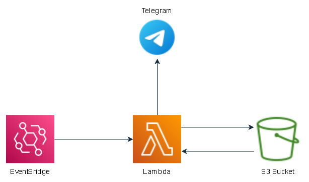
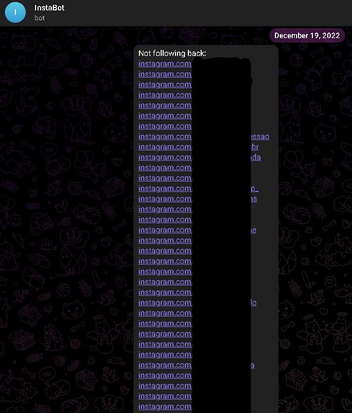

# AWS InstaBot
## Visão geral
Este projeto consiste em desenvolver um bot que verifique sua lista de seguindo e seguidores no Instagram e envie mensagem diariamente via Telegram notificando quem deixou de seguir. Também possuindo funções de mostrar quem você segue mas não segue você de volta.

Já inicio informando que após de uns 5 dias do bot funcionando perfeitamente ele começoa a apresentar o erro `HTTP Error 400 (Bad Request) on GraphQL Query`, irei corrigir o erro e talvez mudar a biblioteca utilizada para acessar o Instagram, mas por enquanto irei postar do jeito que está para já registrar aqui em meu Github.

Para que o bot funcionasse foi necessário retirar a autentificação de 2 fatores do Instagram como também a permissão para acessar o local do dispositivo, pois moro em outro estado e o código estava rodando em um servidor localizado em São Paulo.

Todos os códigos e comentários estão em inglês.

## Arquitetura no AWS
Foram utilizadas 3 ferramentas do AWS para o projeto: Lambda Function, Simple Storage Service (S3) e Amazon EventBridge.



### S3
É um sistema simples de armazenamento de arquivos no AWS permitindo armazenar qualquer tipo de arquivo, foi utilizado formato JSON para armazenar a lista de seguidores e seguindo do instagram no seguinte formato:
```
{
  "username": "user",
  "followees": ["u1", "u2", "u3"],
  "followers": ["u4", "u5", "u6"]
}
```
Tendo como chave e nome do arquivo o nome do usuário no Instagram por ser único.

### Lambda Function
É um local onde podem ser inseridos e executados códigos de diferentes linguagens, a utilizada neste projeto foi Python.
Todos os códigos estão nos arquivos .py presentes neste diretório incluindo a Classe (InstaBot) criada e utilizada.

### EventBridge
Neste projeto foi utilizado apenas para acionar a Lambda Function que verifica quem deixou de seguir o usuário cadastrado.

## Metodologia
Inicialmente foi construído o bot no computador local para acertar o algoritmo, a lógica dos arquivos e a criação da classe [InstaBot](https://github.com/mickaelyoshua7674/Portifolio/blob/9502a51202fc3d14e1c71cc63024f456888f9797/insta_telegram_notifier/InstaBot.py), em seguida foi implementado no AWS (Amazon Web Service).
Na implementação no AWS foi criado um script para [registrar os seguidores e seguidos](https://github.com/mickaelyoshua7674/Portifolio/blob/2ce02e1b012df9a98d6691ae2172935a79863414/insta_telegram_notifier/save-followees-followers-InstaBot.py) no S3 Bucket, outro script para [notificar da lista de todos que não seguem de volta](https://github.com/mickaelyoshua7674/Portifolio/blob/9502a51202fc3d14e1c71cc63024f456888f9797/insta_telegram_notifier/get-not-follow-back-InstaBot.py) e por fim o script para [notificar quem deixou de seguir](https://github.com/mickaelyoshua7674/Portifolio/blob/9502a51202fc3d14e1c71cc63024f456888f9797/insta_telegram_notifier/get-unfollowers-InstaBot.py).

## Resultados
O bot funcionou por um curto período de tempo até apresentar erros, mas foram resultados promissores:

Lista dos que não seguem de volta




Deixou de seguir


## Observações
Como dito anteriormente, para funcionar de forma adequada deve ser desativada a verificação de 2 fatores do Instagram como também a permissão para acessar a localização do dispositivo, no entando está apresentando o erro `HTTP Error 400 (Bad Request) on GraphQL Query` que posteriormente irei corrigir.

## Melhorias futuras
Invés de utilizar a biblioteca `instaloader`, fazer testes com a biblioteca `selenium` para acessar o Instagram do usuário e pegar seus seguidores e seguindo.

Uma outra ideia seria incrementar a arquitetura no AWS utilizando DynamoDB e API Gateway, onde no DynamoDB seria registrado numa tabela os identificadores dos arquivos dos usuários registrados no S3 Bucket e criar uma API através do API Gateway e uma Lambda Function para pegar esses identificadores e a partir deles recuperar a lista de seguidores e seguindo no S3 Bucket.

